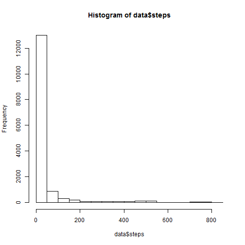

Peer Assessment 1
=========================
What is mean total number of steps taken per day?
-------------------------
We set the work directory, and then read the data

```r
data<-read.csv("activity.csv")
library(ggplot2)
```

```
## Warning: package 'ggplot2' was built under R version 3.0.3
```

```r
library(lattice)
```

```
## Warning: package 'lattice' was built under R version 3.0.3
```

```r
library(knitr)
head(data)
```

```
##   steps       date interval
## 1    NA 2012-10-01        0
## 2    NA 2012-10-01        5
## 3    NA 2012-10-01       10
## 4    NA 2012-10-01       15
## 5    NA 2012-10-01       20
## 6    NA 2012-10-01       25
```
  
1. Make a histogram of the total number of steps taken each day.

```r
hist(data$steps)
```

 
  
2. Calculate and report the mean and median total number of steps taken per day.

```r
mean(data$steps, na.rm=TRUE)
```

```
## [1] 37.38
```

```r
median(data$steps, na.rm=TRUE)
```

```
## [1] 0
```
<!-- data[is.na(data$steps)==FALSE,] -->

What is the average daily activity pattern?
-------------------------

1. Make a time series plot (i.e. type = "l") of the 5-minute interval (x-axis) and the average number of steps taken, averaged across all days (y-axis)

```r
q=split(data$steps, data$interval )
dane<-aggregate(steps ~ interval, data = data, FUN= "mean" )
qplot(interval, steps, data=dane, geom="line")
```

 
2. Which 5-minute interval, on average across all the days in the dataset, contains the maximum number of steps?

```r
subset(dane$interval, dane$steps==max(dane$steps))
```

```
## [1] 835
```
Imputing missing values
-------------------------

1. Note that there are a number of days/intervals where there are missing values (coded as NA). The presence of missing days may introduce bias into some calculations or summaries of the data.

2. Calculate and report the total number of missing values in the dataset (i.e. the total number of rows with NAs)

```r
nrow(subset(data, is.na(data)==TRUE))
```

```
## [1] 2304
```
3. Devise a strategy for filling in all of the missing values in the dataset. The strategy does not need to be sophisticated. For example, you could use the mean/median for that day, or the mean for that 5-minute interval, etc.
  
  I choose the strategy, the if there is a missing value i put the mean for this interval. 
4. Create a new dataset that is equal to the original dataset but with the missing data filled in.

```r
data2<-data
for (i in 1:nrow(data)){
  if (is.na(data2[i,1])==TRUE){
    data2[i,1]=subset(dane$steps, dane$interval==data2[i,3])
  }
  i=i+1
}
head(data2)
```

```
##     steps       date interval
## 1 1.71698 2012-10-01        0
## 2 0.33962 2012-10-01        5
## 3 0.13208 2012-10-01       10
## 4 0.15094 2012-10-01       15
## 5 0.07547 2012-10-01       20
## 6 2.09434 2012-10-01       25
```
5. Make a histogram of the total number of steps taken each day and Calculate and report the mean and median total number of steps taken per day. Do these values differ from the estimates from the first part of the assignment? What is the impact of imputing missing data on the estimates of the total daily number of steps?

```r
hist(data2$steps)
```

 

```r
mean(data2$steps)
```

```
## [1] 37.38
```

```r
median(data2$steps)
```

```
## [1] 0
```
  No, the value is the same, but it is beacuse of the choosen way of replacing "NA" values. 
  The total daile number of steps will be higher after imputing the missing data. 
Are there differences in activity patterns between weekdays and weekends?
-------------------------

1. For this part the weekdays() function may be of some help here. Use the dataset with the filled-in missing values for this part.

2. Create a new factor variable in the dataset with two levels – “weekday” and “weekend” indicating whether a given date is a weekday or weekend day.

```r
data2$date<-as.Date(data2$date)
data3<-cbind(data2,weekdays(data2$date))
colnames(data3)<-c("steps","date","interval","day")
q<-as.matrix(data3$day)
i=1
for (i in 1:nrow(data)){
  if ((data3$day[i]=="sobota"|data3$day[i]=="niedziela")==TRUE){
    q[i]="weekend"
  }else{
   q[i]="weekday" 
  }
  i=i+1
}
q<-as.factor(q)
data4<-cbind(data2,q)
head(data4)
```

```
##     steps       date interval       q
## 1 1.71698 2012-10-01        0 weekday
## 2 0.33962 2012-10-01        5 weekday
## 3 0.13208 2012-10-01       10 weekday
## 4 0.15094 2012-10-01       15 weekday
## 5 0.07547 2012-10-01       20 weekday
## 6 2.09434 2012-10-01       25 weekday
```
3. Make a panel plot containing a time series plot (i.e. type = "l") of the 5-minute interval (x-axis) and the average number of steps taken, averaged across all weekday days or weekend days (y-axis). See the README file in the GitHub repository to see an example of what this plot should look like using simulated data.

```r
new<-aggregate(steps ~ q + interval, data = data4, FUN= "mean" )
xyplot(steps~interval | q, data=new, type = "l", layout = c(1, 2) )
```

 
